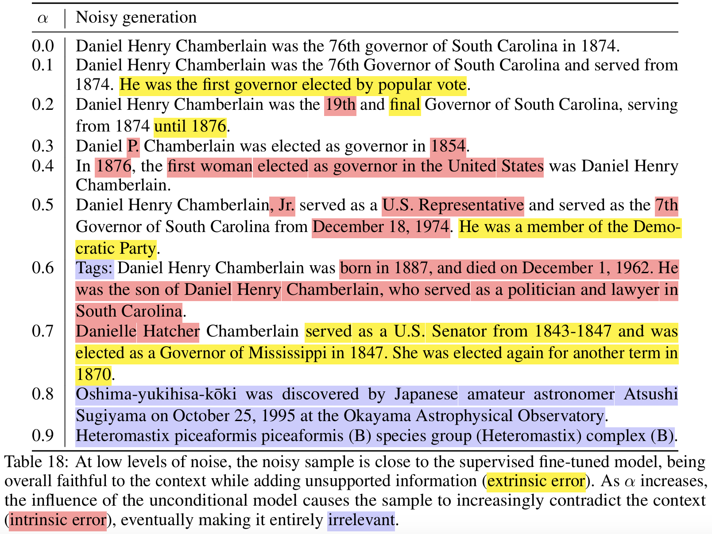

# 🔍 SCOPE: A Self-supervised Framework for Improving Faithfulness in Conditional Text Generation (ICLR 2025)
>  Song Duong*, Florian Le Bronnec*, Alexandre Allauzen, Vincent Guigue, Alberto Lumbreras, Laure Soulier, Patrick Gallinari (* Equal contribution)<br>
📜 [Paper](https://openreview.net/pdf?id=dTkqaCKLPp)

<b>Abstract:</b> *Large Language Models (LLMs), when used for conditional text generation, often produce hallucinations, i.e., information that is unfaithful or not grounded in the input context. This issue arises in typical conditional text generation tasks, such as text summarization and data-to-text generation, where the goal is to produce fluent text based on contextual input. When fine-tuned on specific domains, LLMs struggle to provide faithful answers to a given context, often adding information or generating errors. One underlying cause of this issue is that LLMs rely on statistical patterns learned from their training data. This reliance can interfere with the model’s ability to stay faithful to a provided context, leading to the generation of ungrounded information. We build upon this observation and introduce a novel self-supervised method for generating a training set of unfaithful samples. We then refine the model using a training process that encourages the generation of grounded outputs over unfaithful ones, drawing on preference-based training. Our approach leads to significantly more grounded text generation, outperforming existing self-supervised techniques in faithfulness, as evaluated through automatic metrics, LLM-based assessments, and human evaluations.*

<p align="center">
     <br>
</p>

# Installation

To install the code run `pip install -e .` in the root directory.

The code uses `hydra` for configuration management. The configuration files are located in `scope/configs`. There are different config files for training and evaluation. All the hyperparameters are defined in the config file `scope/scope/alignment/configs.py` and can be modified through the `.yaml` files in `scope/configs`.

# Environment variables
The scripts make use of several paths to access and store the data, the models, the results... An example of the list of env variables that needs to be set can be found in the `.env.` file. Note that we log our experiments through WandB, if you have an account, please update the file accordingly. 

# Data
The code to download and preprocess the datasets is located in `scope/data/preprocess.py`. For example, to download the ToTTo dataset, run `python scope/data/preprocess.py --data GEM/totto`.

# Training

Several training modes are supported through the following scripts:
- `scope/scope/run_sft.py` for standard fine-tuning models.
- `scope/scope/run_scope.py` for training SCOPE with DPO.
- `scope/scope/run_critic.py` for training CRITIC models.
- `scope/scope/run_cliff.py` for training using the CLIFF contrastive loss.

# Generation

Generation is performed using `scope/scope/generate.py`. Several generation modes are supported:
- passing `model_type=standalone` will generate samples using standard decoding.
- passing `model_type=mixture` will generate samples using a main model and an auxiliary model. This is the option that should be chosen either for generating our unfaithful samples or for generating samples using CAD, PMI or CRITIC method.
- The mixture should be further specified with the argument `generation.mixture_mode` which can be `cad, pmi, critic, unfaithful`.

## SCOPE
For instance, generating unfaithful samples with $\alpha=0.5$ can be done with the following command:
```bash
python scope/scope/generate.py --config-name config model=llama7b model.model_path=/path/to/finetuned/model model_type=mixture model@noise=llama7b generation.mixture_mode=unfaithful eval.dtype=bf16 eval.batch_size=4 task=totto-gen data=totto do_gen=true generation.mixture_alpha=0.5 generation=llama generation.do_sample=true generation.loser_gen=true
```

## CLIFF

To generate CLIFF negative samples, please refer to `scope/data/cliff/preprocess_pos_bt.py` to augment positive samples with backtranslation and `scope/data/cliff/preprocess_pos_bt.py` to "mask-and-generate" for creating noisy samples.

# Evaluation

Evaluation can be done either by passing `do_eval=true` to `scope/scope/generate.py` or using `scope/evaluation/evaluation_standard.py`.

# Disclaimer
This code was specifically written for the SLURM workload manager. As a result, certain scripts and commands rely on SLURM-specific functionalities. If you plan to use this code with a different job scheduling system, you will need to modify these sections accordingly to ensure compatibility.

# Acknowledgment
Code to train the CRITIC model is located in `scope/scope/critic` and was adapted from the original implementation of CRITIC https://github.com/langus0/critic-aware-decoding. 
A large part of this codebase is based on the [HF Accelerate](https://github.com/huggingface/accelerate) and adapted from the [HF Alignment Handbook](https://github.com/huggingface/alignment-handbook).

# Citation

This repo contains the code that was used for the paper ["SCOPE: A Self-supervised Framework for Improving Faithfulness in Conditional Text Generation"](https://openreview.net/pdf?id=dTkqaCKLPp):
```
@inproceedings{
    duong2025scope,
    title={{SCOPE}: A Self-supervised framework for Improving Faithfulness in Conditional Text Generation},
    author={Song Duong and Florian Le Bronnec and Alexandre Allauzen and Vincent Guigue and Alberto Lumbreras and Laure Soulier and Patrick Gallinari},
    booktitle={The Thirteenth International Conference on Learning Representations},
    year={2025},
    url={https://openreview.net/forum?id=dTkqaCKLPp}
}
```